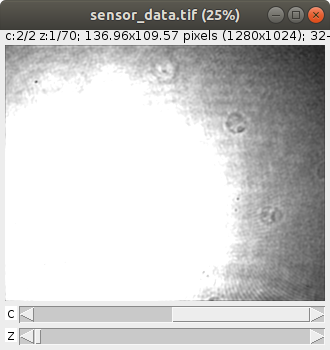
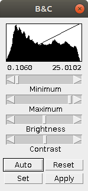
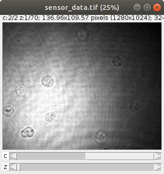

.. _section_trouble:

===============
Troubleshooting
===============

Freezing / no output
~~~~~~~~~~~~~~~~~~~~
If the :ref:`CLI <section_command_line_interface>` freezes and you see a
blinking cursor for a very long time without any files being created
or changed in the output directory (*_dm* appended to the input data set):

1. Remove all files in the output directory, **except** for *drymass.cfg*.
2. Run the analysis again.

Amplitude sensor image is over-saturated (Fiji)
~~~~~~~~~~~~~~~~~~~~~~~~~~~~~~~~~~~~~~~~~~~~~~~
When you open the ``sensor_data.tif`` file generated by DryMass with
`Fiji <https://fiji.sc/>`_, you might encounter a situation where the
phase data (channel 1) looks fine, but the amplitude data (channel 2)
is over-saturated.

The reason for this is that Fiji does not automatically
adjust the brightness and contrast for this multi-channel image series.
The solution is to adjust the brightness manually. Go to *Image* | *Adjust...* |
*Brightness/Contrast* and click the *Auto* button.

None of the above
~~~~~~~~~~~~~~~~~
Please `create an issue <https://github.com/RI-imaging/DryMass/issues>`_ on
GitHub with a screenshot (or copy-paste) of the error message.
