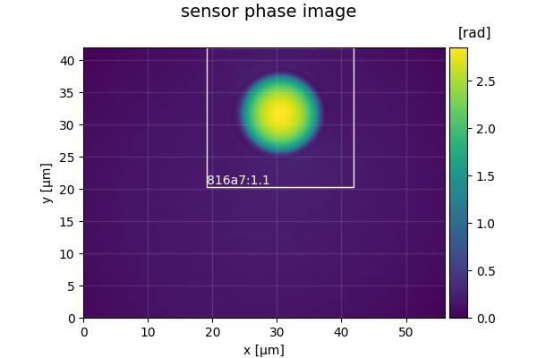

.. _tutorial01:

=======================
T1: Bead analysis (CLI)
=======================

Introduction
------------
Microgel beads are transparent, homogeneous, and spherical objects
that are ideal test objects for quantitative phase imaging. The DryMass
command :ref:`section_dm_analyze_sphere` can estimate the average
refractive index of such homogeneous objects. This is a short tutorial
that will reproduce the data presented in
`supplementary figure 2a <https://arxiv.org/src/1706.00715v3/anc/S02_2D_phase_measurements.pdf>`_
of reference :cite:`Schuermann2017`.

Prerequisites
-------------
For this tutorial, you need:

- Python 3.6 or above and DryMass version 0.6.0 or above (see :ref:`section_install`)
- `Fiji <https://fiji.sc/>`_ or Windows Photo Viewer (for data visualization)
- Experimental dataset: `QLSR_PAA_beads.zip <https://ndownloader.figshare.com/files/17722790>`_ :cite:`MuellerQPIref19`

Execute dm_analyze_sphere
-------------------------
DryMass comes with a :ref:`section_command_line_interface` (CLI)
which is made available after the installation.
We will use the DryMass command  :ref:`section_dm_analyze_sphere`
to extract the refractive index values of a population of microgel
beads. Using the command shell of your operating system, navigate
to the location of
`QLSR_PAA_beads.zip <https://github.com/RI-imaging/QPI-data/raw/master/QLSR_PAA_beads.zip>`_
and execute the command ``dm_analyze_sphere`` with
``QLSR_PAA_beads.zip`` as an argument. You will be prompted for
the refractive index of the surrounding medium (1.335), the
detector pixel size in microns (0.14), and the wavelength in
nanometers (647). Simply type in these values (press the `Enter`
key to let DryMass acknowledge each input). On Windows, this
will look similar to this:

DryMass has created a directory called ``QLSR_PAA_beads.zip_dm`` (the
input argument with `_dm` appended) which contains the following
files

- **drymass.cfg**: DryMass :ref:`sec_configuration_file`
- **roi_data.h5**: regions of interest (ROIs)
- **roi_data.tif**: phase and amplitude data of the ROIs as a tif file
- **roi_slices.txt**: positions of the ROIs
- **sensor_data.h5**: full sensor QPI data
- **sensor_data.tif**: full sensor phase and amplitude data as a tif file
- **sensor_roi_images.tif**: plotted full sensor phase images with ROIs
- **sphere_edge_projection_data.h5**: simulated (projection) phase and amplitude data
- **sphere_edge_projection_images.tif**: visualization of the sphere analysis of the ROIs as a tif file
- **sphere_edge_projection_statistics.txt**:  sphere analysis results as a text file

Examine the results
-------------------
Let's have a look at *sensor_roi_images.tif* (using Fiji or Windows
Photo Viewer). This is the first image stored in the tif file:

It shows the full sensor phase image of the first bead. The white rectangle
indicates the ROI that was found by DryMass, labeled with the identifier
*a8dca:1.1*. The file *sensor_roi_images.tif* allows you to check that
DryMass has correctly found the objects that you are interested in. If the
beads were not detected correctly, we would probably have to adjust the
size parameter in the :ref:`sec_configuration_file` (see also 
:ref:`section_dm_extract_roi`).

It appears that DryMass has correctly found all beads with the default
settings. Next, open the file *sphere_edge_projection_images.tif*. The
identifier of the first ROI is shown at the top, the first column contains
phase and intensity of the experimental data, the second column contains
the modeled data (with refractive index and radius used for the simulation),
and the third column shows the phase-difference as well as line plots through
the phase images.

.. figure:: t01_sphere_edge_projection_image.jpg

Note that the modeled intensity image is all-one, because the projection
model only models the optical thickness and thus only affects the phase data.
Also, note that the phase-difference image between data and model only has
small deviations in the background phase. If the background phase was
not flat, we would have to modify the :ref:`background correction <config_bg>`.

Post-processing
---------------
A closer examination of the phase-difference images shows that there seem to
be either deformed beads or imaging artifacts in the images with the identifiers
(prepend *a8dca:*): *4.1, 7.1, 24.1, 26.1, 27.1, 35.1, 36.1, 39.1, 40.1, 51.1,
52.1, 55.1, 58.1, 60.1, 64.1, 67.1,* and *71.1*. Due to their asymmetry
we ignore these images in our analysis by editing the configuration file:

.. code-block:: none

  [roi]
  ignore data = 4.1, 7.1, 24.1, 26.1, 27.1, 35.1, 36.1, 39.1, 40.1, 51.1, 52.1, 55.1, 58.1, 60.1, 64.1, 67.1, 71.1

After executing ``dm_analyze_sphere`` again, we can load the statistics file
*sphere_edge_projection_statistics.txt* into a statistical analysis application
and compute the average and the standard deviation of the refractive index.
In Python, this can be done with

.. code-block:: python

   import numpy as np
   ri = np.loadtxt("sphere_edge_projection_statistics.txt", usecols=(1,))

   print("average: ", np.average(ri))
   print("standard deviation: ", np.std(ri))

which will yield a refractive index of 1.357 ± 0.004 which agrees well
with the value given in reference :cite:`Schuermann2017` (1.356 ± 0.004); The
small difference can be explained by a slightly modified analysis pipeline
and originally more strict selection criteria.

