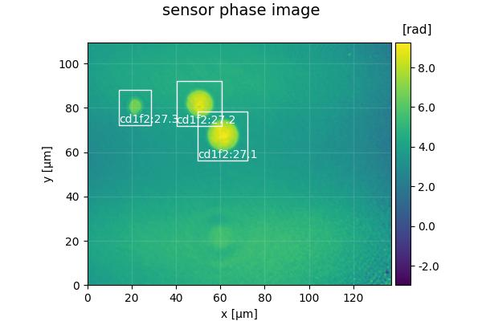
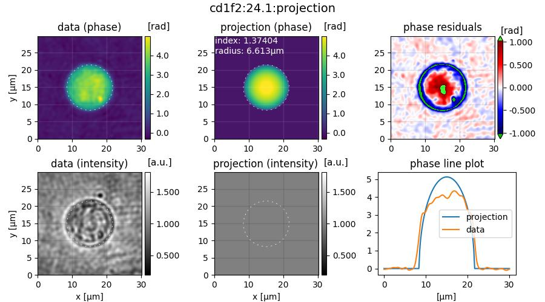
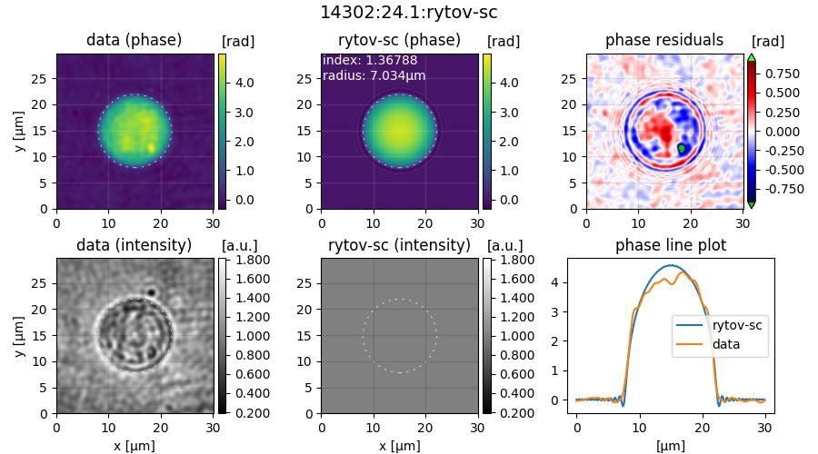
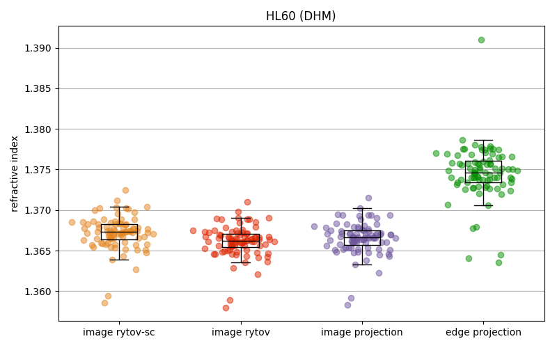

.. _tutorial02:

============================
T2: HL60 cell analysis (CLI)
============================

Introduction
------------
`HL60 <https://en.wikipedia.org/wiki/HL60>`_ cells in suspension are
inhomogeneous, almost-spherical objects. To estimate an average refractive
index (RI) of an HL60 cell population, the DryMass command
:ref:`section_dm_analyze_sphere` can be used. This tutorial reproduces
data presented in figure 5d of reference :cite:`Mueller2018`.

Prerequisites
-------------
For this tutorial, you need:

- Python 3.6 or above and DryMass version 0.6.0 or above (see :ref:`section_install`)
- `Fiji <https://fiji.sc/>`_ or Windows Photo Viewer (for data visualization)
- Experimental dataset: `DHM_HL60_cells.zip <https://ndownloader.figshare.com/files/17722787>`_ :cite:`MuellerQPIref19`

Find regions of interest
------------------------

.. note::

  You can skip this part by copying *roi_slices.txt* from *DHM_HL60_cells.zip*
  into the *DHM_HL60_cells.zip_dm* folder,
  running :ref:`section_dm_convert` and manually adding the ``[roi]``
  section to *drymass.cfg* with ``enabled = False``.

We proceed slightly different than in :ref:`tutorial 1<tutorial01>`. Before
we use the command  :ref:`section_dm_analyze_sphere` to extract the RI
values of the HL60 cells, we have to modify our configuration.
We start by executing

.. code::

    dm_extract_roi DHM_HL60_cells.zip

which prompts
us for the *pixel size* (0.107µm), and the *wavelength* (633nm),
which can be found in the *readme.txt* file inside the zip archive.
This command imports the raw data and searches for cells in the phase
data. Opening the file *sensor_roi_images.tif*, we realize that the search
parameters are not set optimally. This is image 27:

We want to exclude small ROIs and ROIs with a large overlap. Furthermore,
we want to include all large cells (see e.g. image 39). Thus, we change the
following configuration keys in *drymass.cfg*:

.. code-block:: none

  [specimen]
  # approximate cell diameter we are looking for [µm]
  size um = 13

  [roi]
  # increase border size around cells
  pad border px = 80
  # do not allow large variations of specimen size
  size variation = 0.2
  # exclude ROIs with an overlap > 100px
  exclude overlap px = 100

With the new configuration, we run ``dm_extract_roi DHM_HL60_cells.zip`` again.
Now all cells are detected. However, we want to exclude a few due to artifacts
or shape issues. To achieve that, we tell DryMass to ignore the corresponding
ROIs in *drymass.cfg*

.. code-block:: none

  [roi]
  ignore data = 8.4, 18.2, 18.3, 35.2

After executing ``dm_extract_roi`` again, these ROIs are labeled red in
*sensor_roi_images.tif*. There should now be a total of 87 ROIs.

Set 2nd order polynomial background correction
----------------------------------------------
The default setting for background correction in DryMass is *tilt* which
means that all phase data are corrected by fitting a 2D tilt image to the
image borders. For the present dataset, a second order polynomial fit is
a better approach, because the background phase does not follow a linear
trend. Thus, we choose the *poly2o* profile and additionally set the fitting
border width to 30 pixels. These are the updated lines in the
``[bg]`` section of *drymass.cfg*:

.. code-block:: none

  [bg]
  phase border px = 30
  phase profile = poly2o

Perform sphere analysis
-----------------------
We now run

.. code::

    dm_analyze_sphere DHM_HL60_cells.zip

and are asked to enter
the RI of the medium (1.335). By default, the RI of the cells is computed
according to :cite:`Schuermann2015`. The following files are created during
this step:

- *sphere_edge_projection_data.h5*: QPI data
- *sphere_edge_projection_images.tif*: data visualization
- *sphere_edge_projection_statistics.txt*: results

.. note::

    If you are using *roi_slices.txt* (above note), you can safely
    ignore warnings about *slice and QPImage identifiers*.
    Setting the RI of the medium changes the internal ROI identifiers.
    Since we have fixed the ROIs, the identifiers do not match anymore,
    but the enumeration is still correct.

Let's have a look at the visualization of ROI 24.1 in
*sphere_edge_projection_images.tif*. 

The first column shows the experimental data, the second column shows
the modeled data (with the cell perimeter indicated by a dashed circle),
and the third column contains a residual image (pay attention to the colorbar,
green means that the values are outside of the displayed range) and a
line plot through the center of the cell. What is most striking about these
data is that the RI is overestimated while the radius is underestimated
by the edge-projection model.
The explanation is that the radius of the cell is determined with an
edge-detection algorithm applied to the phase image. Since the
edge-detection algorithm determines the edge on the slope of the phase
profile and not where the phase profile starts to deviate from the background,
it underestimates the radius. The solution to this problem is to take into
account the full phase image when determining RI and radius :cite:`Kemper2007b`
:cite:`Mueller2018`.

This can be achieved by modifying the ``[sphere]`` section of *drymass.cfg*.
In figure 5d of reference :cite:`Mueller2018`, multiple RI-retrieval methods are
applied and compared for the same cell population. To repdroduce these
data, we run ``dm_analyze_sphere DHM_HL60_cells.zip`` three more times
with a modified ``[sphere]`` section (note that this may take a while).

- Run 1: phase image fit with a projection model
  
  .. code-block:: none
  
    [sphere]
    method = image
    model = projection

  which produces the files
  
  - *sphere_image_projection_data.h5*
  - *sphere_image_projection_images.tif*
  - *sphere_image_projection_statistics.txt*

- Run 2: phase image fit with the Rytov approximation
  
  .. code-block:: none
  
    [sphere]
    method = image
    model = rytov

  which produces the files
  
  - *sphere_image_rytov_data.h5*
  - *sphere_image_rytov_images.tif*
  - *sphere_image_rytov_statistics.txt*

- Run 3: phase image fit with the systematically corrected Rytov approximation
  
  .. code-block:: none
  
    [sphere]
    method = image
    model = rytov-sc

  which produces the files
  
  - *sphere_image_rytov-sc_data.h5*
  - *sphere_image_rytov-sc_images.tif*
  - *sphere_image_rytov-sc_statistics.txt*

.. note::

  We omitted the case ``model = mie-avg`` which is part of figure 5d
  in reference :cite:`Mueller2018`, because of the long fitting
  time.

To verify that the full-phase-image-based approaches indeed yield lower
residuals than the edge-detection approach, let's have a look at ROI 24.1
of *sphere_image_rytov-sc_images.tif*.

 
The phase difference and the phase line plots look much better now. Observed
deviations mostly originate from the inhomogeneity of the cell.

Plot the results
----------------
To plot the results, we use the 
:download:`following Python script <t02_method_comparison.py>`.

.. literalinclude:: t02_method_comparison.py
    :language: python
    :linenos:

Discussion
----------
The above figure correctly reproduces the message conveyed with figure 5d of
reference :cite:`Mueller2018`. There are only minor differences that can
be explained by a slightly different analysis pipeline:

- In :cite:`Mueller2018`, 84 cells were analyzed as opposed to the 87 cells
  shown here. This can be attributed to the improved object detection
  pipeline introduced in DryMass 0.1.4.

- In :cite:`Mueller2018`, the phase data were background-corrected with
  background data (not included in *DHM_HL60_cells.zip*) and a linear model
  (``phase profile = tilt``) as opposed to a second order
  polynomial model (which was introduced in DryMass 0.1.3). However, this
  does not seem to have any significant effect on the results, which
  indicates that the analysis methods are robust.

- There is a prominent outlier in the *edge projection* results set. The
  reason for this outlier is a falsely detected contour (see ROI 1.0).
  This ROI was not included in the analysis of :cite:`Mueller2018`.

- Other minor differences might originate from the fact that the hologram
  data is processed differently (``[holo]`` section of *drymass.cfg*).
  In :cite:`Mueller2018`, a gaussian filter is used whereas DryMass defaults
  to a disk filter. For more information on this topic, see e.g.
  :ref:`qpimage:example_hologram_filters`.

