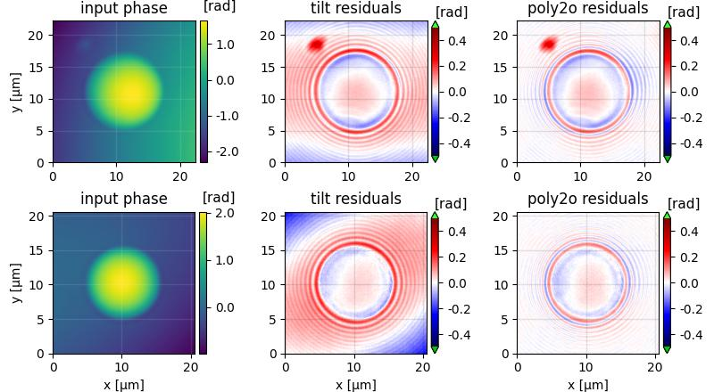
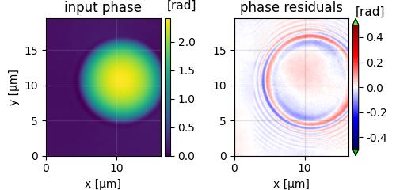
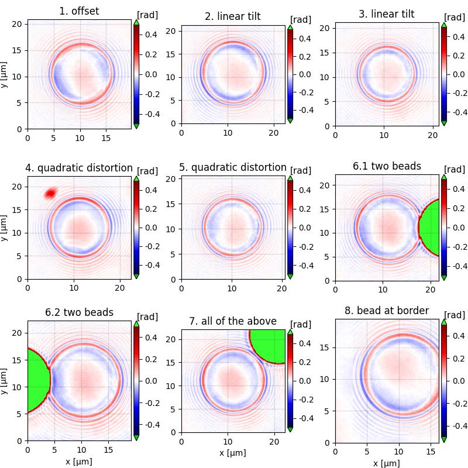

.. _tutorial03:

================================================
T3: Correcting for background and geometry (CLI)
================================================

Introduction
------------
Often, the input data are not optimal, for instance due to limitations
of the measuring setup. DryMass offers several ways of dealing with
the resulting artifacts. This tutorial uses polyacrylamide (PAA) bead
measurements that were artificially altered to reproduce the following
list of artifacts:

1. A constant offset in the phase image.
2. A linear tilt in the phase image along one coordinate axis.
3. A linear tilt in the phase image along both coordinate axes.
4. A quadradic phase distortion along one axis and a phase tilt along the other axis.
5. Quadradic phase distortions along both coordinate axes.
6. Two beads that are close to each other.
7. All of the above.
8. A bead that is cut at the image border.

Please note that these are designed examples, i.e. the methods described
here to fix these artifacts might not always work and their combination
might not work for heterogeneous samples.

Prerequisites
-------------
For this tutorial, you need:

- Python 3.6 or above and DryMass version 0.5.0 or above (see :ref:`section_install`)
- `Fiji <https://fiji.sc/>`_ or Windows Photo Viewer (for data visualization)
- Experimental data set: `QLSR_PAA_beads_bg-modified.zip <https://github.com/RI-imaging/QPI-data/raw/master/QLSR_PAA_beads_bg-modified.zip>`_

Take a glimpse at the data
--------------------------
For this tutorial, the downloaded zip archive has to be extracted prior
to the analysis. The extracted archive contains a readme file and the
experimental data *QLSR_PAA_beads_bg-modified.h5* in the qpimage file format.
DryMass can extract all relevant metadata from this file format (in contrast to
the file formats used in tutorials 1 and 2), such that no manual
intervention is required when running :ref:`section_dm_analyze_sphere`:

.. code-block:: none

    dm_analyze_sphere C:\\path\to\QLSR_PAA_beads_bg-modified.h5

Please open the output folder (*QLSR_PAA_beads_bg-modified.h5_dm*) and
take a look at the file *sensor_roi_images.tif*. You can see
the different artifacts discussed above (offset, tilt, etc.). In the file
*sphere_edge_projection_images.tif*, you see that the default
background correction strategy does not work for all measurements.
Furthermore, notice that for the last three measurements no regions of interest
(ROIs) were detected with the default parameters. As a result, these
three measurements are not represented in *sphere_edge_projection_images.tif*.
These issues are discussed and resolved in the following.

Select 2nd order polynomial background correction
-------------------------------------------------
A simple tilt-based background correction does not work for the measurements
with the quadratic background. Setting the background correction to
a second order polynomial resolves this issue. In the configuration
file *drymass.cfg* (located in the output folder), edit the *[bg]* section:

.. code-block:: none

  [bg]
  phase profile = poly2o

Now the background is sufficiently flat for the first five ROIs.

    Comparison of tilt correction and poly2o correction. The first row
    shows a bead with a quadratic background phase along one axis and
    a phase tilt along the other. The second row shows a quadratic
    background phase along both coordinate axes. The first column
    shows the raw input phase, and the second and third columns show
    the phase error when using the tilt and poly2o correction for
    a sphere analysis based on the edge-detection algorithm.

Include beads that are close to each other
------------------------------------------
DryMass automatically removes ROIs that are very close to each other, as
this might have a negative effect on the subsequent analysis steps. To include
these beads, we lift this restriction by modifying the *[roi]* section:

.. code-block:: none

  [roi]
  exclude overlap px = 0

In *sensor_roi_images.tif*, you can see that the ROIs of the beads
are now included in the analysis. However, in
*sphere_edge_projection_images.tif* you observe that the second bead
seems to have a negative effect on the background correction. To resolve
this issue, we set a binary threshold in the original image above which
no data is used for background correction. Since it is difficult to set
such a threshold manually, we use one of the threshold filters implemented
in scikit-image that works well for this example: `threshold_triangle
<http://scikit-image.org/docs/stable/api/skimage.filters.html#threshold-triangle>`_

.. code-block:: none

  [bg]
  phase binary threshold = threshold_triangle

Now we have established a robust background correction pipeline that
includes all but one bead.

    Phase binarization for background correction. Each row shows
    one exemplary bead in close proximity to another bead. A simple
    background correction using the pixels at the border of the image
    (second column) does not work because of the second bead. To
    resolve this issue, triangle thresholding is used to use only
    those pixels for background correction that do not belong to
    a bead (third column).

Include beads at the border of the sensor image
-----------------------------------------------
By default, all ROIs that are within ten pixels of the border of the
sensor image are removed from the analysis. We can inlcude all ROIs
by setting this distance to zero:

.. code-block:: none

  [roi]
  dist border px = 0

The bead in the final measurement is now included in the analysis.

    Objects at the image border can be included in the analysis.

Exact determination of radius and refractive index
--------------------------------------------------
The edge-detection algorithm, as implemented in DryMass, causes an
underestimation of the beads radii and thus an overestimation of the
refractive index. To retrieve more reliable results, we modify the
*[sphere]* section to use the systematically-corrected Rytov
approximation (see :cite:`Mueller2018`):

.. code-block:: none

  [sphere]
  method = image
  model = rytov-sc

    Phase errors when fitting with the Rytov approximation. The plots
    correspond to the different cases presented in the introduction.
    The residuals are reduced signigicantly when compared to the
    edge-detection approach (all figures above).
